# HMSS Diagrams (Mermaid)

Paste each code block into https://mermaid.live to render and export as PNG/SVG.

---

## 1. Use Case Diagram - Visitor

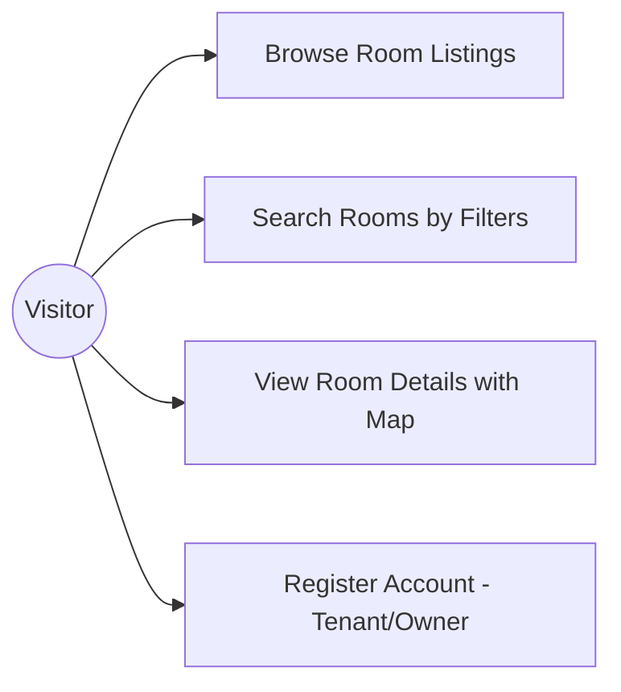

## 2. Use Case Diagram - Tenant

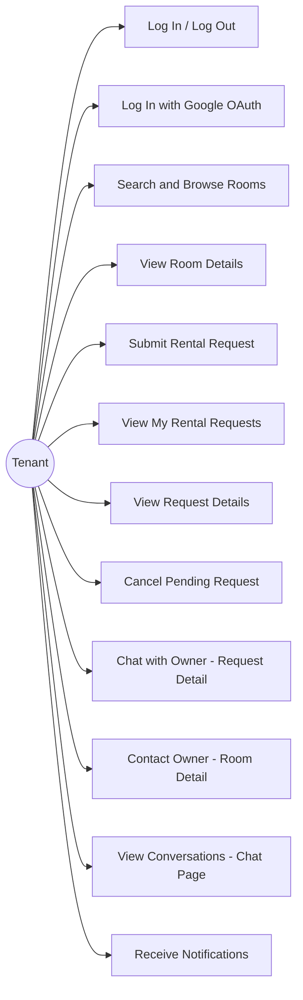

## 3. Use Case Diagram - Owner

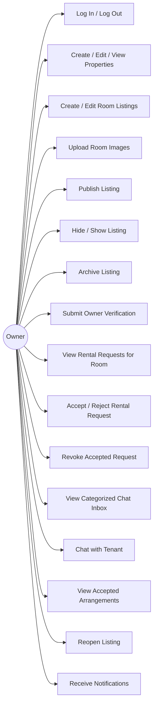

## 4. Use Case Diagram - System Admin

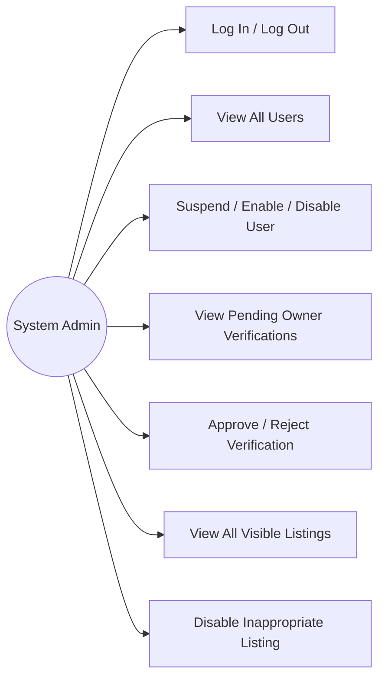

---

## 5. Screen Flow Diagram

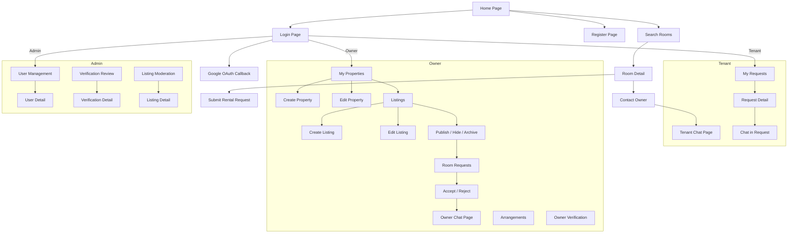

---

## 6. Entity Relationship Diagram (ERD)

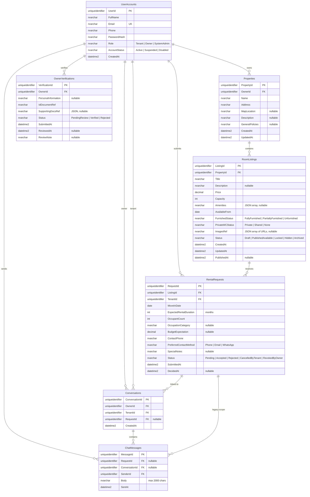

---

## 7. Listing Status State Machine

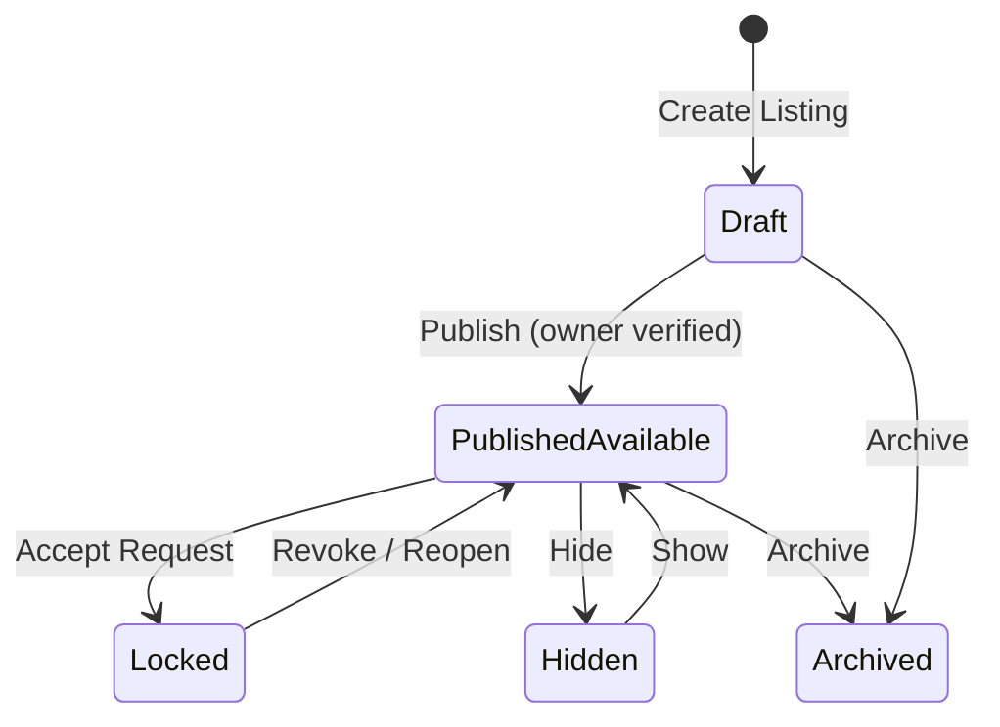

## 8. Rental Request Status State Machine

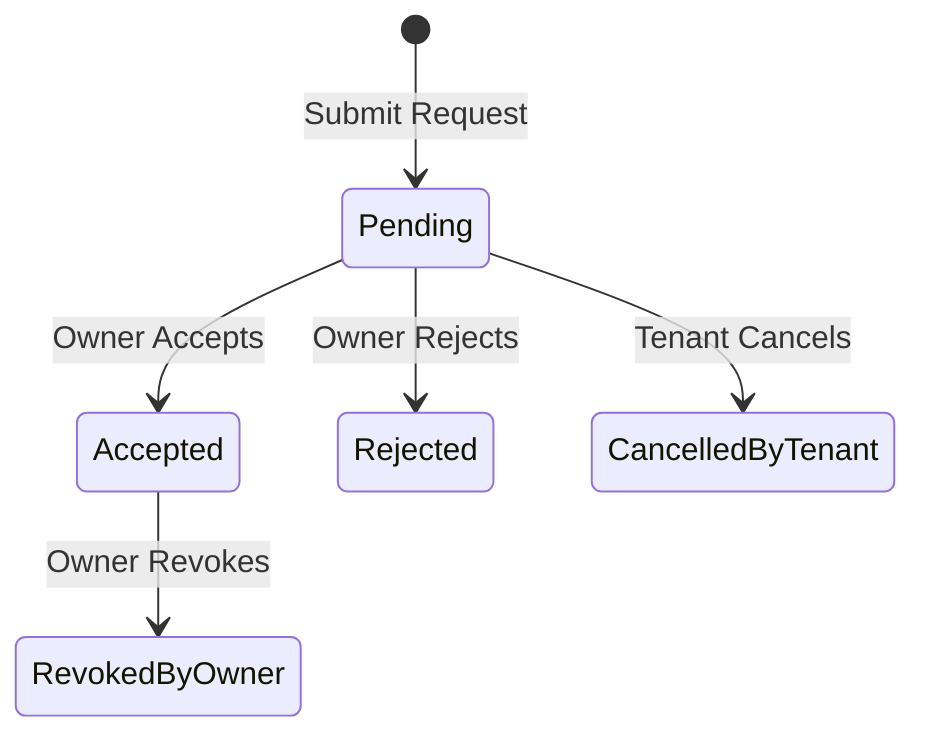

## 9. Account Status State Machine

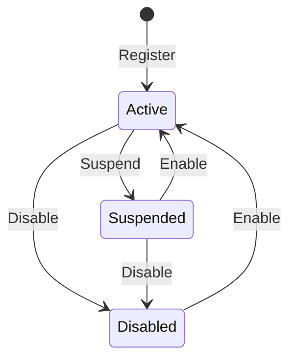

## 10. Owner Verification Status State Machine

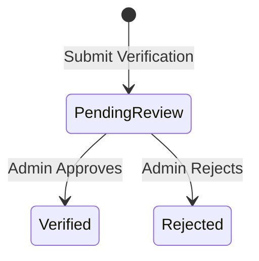

---

## 11. System Architecture

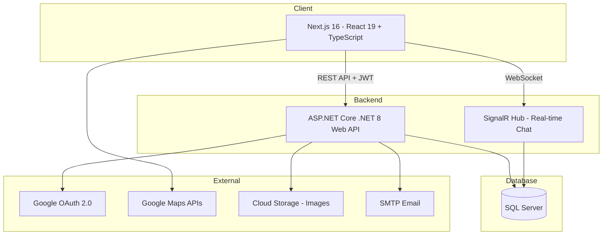
